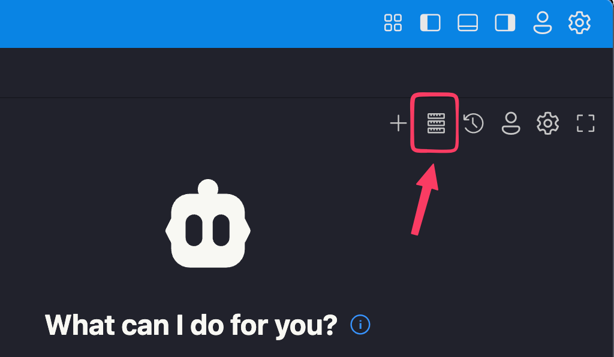

# Getting Started

- [Getting Started](#getting-started)
  - [Repositories](#repositories)
  - [Workflow](#workflow)
  - [Agentic Coding Tool Configuration](#agentic-coding-tool-configuration)
    - [Cline Setup](#cline-setup)
    - [Step 1. Authenticate to AWS](#step-1-authenticate-to-aws)
    - [Step 2. Install 'Cline' from the VSCode marketplace](#step-2-install-cline-from-the-vscode-marketplace)
    - [Step 3. Configure Cline](#step-3-configure-cline)
    - [Step 4. Configure MCP tools](#step-4-configure-mcp-tools)
    - [Step 5. Add agent rules (optional)](#step-5-add-agent-rules-optional)
    - [Cline troubleshooting](#cline-troubleshooting)
  - [Kiro Setup](#kiro-setup)
    - [Step 1. Install Kiro](#step-1-install-kiro)
    - [Step 2. Configure Kiro](#step-2-configure-kiro)
    - [Step 3. Configure MCP tools](#step-3-configure-mcp-tools)
    - [Step 5. Kiro steering documentation (Optional)](#step-5-kiro-steering-documentation-optional)
    - [Step 6. Select "Vibe" interface](#step-6-select-vibe-interface)
    - [Kiro troubleshooting](#kiro-troubleshooting)
  - [Example Prompts](#example-prompts)
    - [Creating a development plan](#creating-a-development-plan)
    - [Reviewing a development plan (optional)](#reviewing-a-development-plan-optional)
    - [Example prompts to help with troubleshooting](#example-prompts-to-help-with-troubleshooting)
  - [Example MCP Client Configuration](#example-mcp-client-configuration)
    - [Troubleshooting: MCP servers not showing up or showing "Error: context cancelled"](#troubleshooting-mcp-servers-not-showing-up-or-showing-error-context-cancelled)

---

> **Note: It is not normal to experience network or reliability issues with the LLMs or MCP servers!**
>
> If you are having issues with certificates, timeouts, packages that fail to download etc... you will need to speak to your tech support person as these would likely be caused by a corporate proxy or firewall configuration that intercepts and interferes with normal network traffic.

## Repositories

- This repo (QR code below): https://github.com/AI-Immersion-Day/getting-started
- Guided tour rep: https://github.com/AI-Immersion-Day/guided-tour


## Workflow

Setup -> Plan -> Act -> Review & Iterate Workflow:


1. **Setup**
   - Ensure the agentic coding tool is setup with effective agent **rules** and agent (MCP) **tools**.
2. **Plan**
   - Ideate with the agent to hone in on the goal and requirements until you're satisfied that the agent and you are on the same page.
   - Prompting the agent to **create a development plan** based to achieve the goal that includes:
     - Relevant context & background information.
     - Requirements / constraints.
     - Measures of success.
     - A **phased checklist of developments tasks** to achieve the goal (important!).
     - Optionally start a fresh session with an agent in parallel and prompt it to read the plan and validate they understand it, asking any clarifying questions as needed.
3. **Act**
   - Start a fresh session.
   - Prompt the agent to read the development plan and begin the first phase of development tasks.
4. **Review and Iterate**
   - Review the work, updating the plan for future phases if required.
   - Iterate towards the goal.
   - Refine any project or global agent rules or access to tools from lessons learned.

The intent of this workflow is to have a simple, clear, reviewable and actionable plan that can be worked from. It allows you to start a fresh session throughout the process without losing track of state, critical context or requirements.

---

## Agentic Coding Tool Configuration

You need to configure your chosen agentic coding tool.

**You do not need to configure _both_ Cline and Kiro. We have more experience with Cline but if you wish to use Kiro we have included some basic configuration steps for it as well.**

### Cline Setup

<details>
<summary>🤖 Click here to view instructions for configuring Cline</summary>

### Step 1. Authenticate to AWS

First make sure you're logged in to AWS so you can use your credentials or profile for access to Amazon Bedrock (this provides the private LLM API access). _Important: Never share your credentials with **anyone**!_

### Step 2. Install 'Cline' from the VSCode marketplace


### Step 3. Configure Cline

Configure Cline as below, choosing to bring your own provider if prompted.


#### API configuration tab (required)

1. Set your API provider to 'Bedrock'
2. Configure your Bedrock access key (or AWS profile / credentials if using those instead)
   - The operations support person from your company should be able to help you with this if needed.
   - Note that depending on your companies AWS setup you may need to refresh these after a given time (e.g. 4-12 hours)
3. Enable cross-region inference, global inference profile and prompt caching
4. Enable thinking (leave as the default number of tokens)
5. Select `anthropic.claude-sonnet-4-5-2025-0929-v1:0` as your model


#### Features tab (recommended)

- Enable "Checkpoints" and "Auto Compact"
- The other defaults are fine to leave as is

Cline documentation is available here: [Cline Docs](https://docs.cline.bot/introduction/welcome)

#### Auto-approve Cline Suggestions (optional)

To optionally enable auto-approving of Cline suggestions (less hand holding):

1. Click auto-approve panel:


2. Enable these settings:


### Step 4. Configure MCP tools

- In Cline's main pane, click this icon up the top: 
  - Click "Configure MCP Servers", which will open the MCP client configuration file (JSON).
  - Here is an example MCP client configuration file: [mcp.json](mcp.json)
  - Alternatively configure your desired MCP servers as desired.

A few seconds after you save the MCP Servers should look something like this, with your MCP servers showing as online:


If you can't get MCP servers working with your corporate proxy/firewall you can still use Cline / any other agentic coding tool without them but the agent will have significantly limited capabilities and will have to use command line tools to interact with the system and get information from online sources.

### Step 5. Add agent rules (optional)

You can click the button with the scales icon to add agent rules to influence and align the agents behaviour.


There are example rules in [./examples/example_agent_rules.md](./examples/example_agent_rules.md) you can use these as a starting point if you wish.

### Cline troubleshooting

Below is a small collection of issues we encountered while testing Kiro along with possible solutions / workarounds that may be helpful.

#### Model returns an error related to "thinking" or "temperature"

- Either set temperature to 1 or disable thinking in the provider API settings.

</details><br>

**OR**

## Kiro Setup

<details>
<summary>🤖 Click here to view instructions for configuring Amazon Kiro</summary>

Note: Amazon Kiro documentation is available here: [Kiro Docs](https://kiro.dev/docs/)

### Step 1. Install Kiro

https://kiro.dev/downloads/

### Step 2. Configure Kiro

1. Open Kiro's settings.
2. Set "Agent Autonomy" to "Autopilot"

### Step 3. Configure MCP tools

3. Set "Configure MCP" to "Enabled"
4. Enable "Trust Read Only Commands", "Usage Summary" and notifications for "Agent: Action Required" and "Agent: Failure"


1. Click "Open User MCP Config" and configure your MCP servers:


1. Click the Kiro button in the left hand sidebar:


1. You should see your configured MCP servers enabled:


### Step 5. Kiro steering documentation (Optional)

[Kiro has a different way of defining rules](https://github.com/kirodotdev/Kiro/issues/869) from other agentic coding tools. Instead of creating a file like AGENTS.md, CLAUDE.md, .clinerules etc., you need to create "steering documentation": https://kiro.dev/docs/steering/

The simplest way to do this is:

1. Navigate to the Steering section in the Kiro panel
2. Click the + button to create a new .md file
3. Choose a descriptive filename (e.g., api-standards.md)
4. Write your guidance using standard markdown syntax

Important: These must be created for each codebase you work on as at this time Kiro does not seem to have support for global (cross-project) rules.

### Step 6. Select "Vibe" interface

In the main Kiro agent (chat) interface you probably want to use "Vibe" mode (ignore the poor naming - we are not doing "vibe coding"):

> Note: Spec mode guides you through creating a very comprehensive spec driven development plan. This might be alright for operating on a single large, complex code repository where you're planning out product changes but it tends to over-complicate and over-engineer solutions.


### Kiro troubleshooting

Below is a small collection of issues we encountered while testing Kiro along with possible solutions / workarounds that may be helpful.

#### Over-engineered solutions

In our testing Kiro had a tendency to over-complicate and over-engineer solutions, some tips:

- Try using "Vibe mode" rather than "Spec mode".
- Add agent rules to the effect of:
  - "Always be mindful not to over-engineer solutions."
  - "Do not add features the user has not asked for."
  - "Favour a less is more approach."
  - "Avoid 'comprehensive' implementations unless the user has explicitly requested it."

#### MCP servers not showing up

If you have issues with no MCP servers showing up in Kiro's list of enabled MCP servers it may mean that there is an error in your MCP client configuration file. Carefully review the file for any typos.

#### Throttling

This message means that you've hit Kiro's rate limiting, you may have to step away for a few minutes and try again:


#### Corrupted install

If you get a message about Kiro being corrupt, you may need to re-download and install Kiro:


</details>

---

## Example Prompts

There are three groups of example prompts provided:
- Simple, shorter prompts [./prompts/simple/](./prompts/simple/)
- Detailed, comprehensive prompts [./prompts/detailed/](./prompts/detailed/)
- Troubleshooting prompts - if your agent gets stuck on a complex issue and you need to give it guidance [./prompts/troubleshooting/](./prompts/troubleshooting/)

### Creating a development plan

For a prompt template that creates detailed plan (the kind of thing you'd build out over time and re-use) after working through the goals, requirements, architecture etc... with an agent see [./prompts/detailed/2-create-plan-detailed.md](./prompts/detailed/2-create-plan-detailed.md)

For a basic alternative to this you can simply prompt:

> "Based on our discussion, create a new markdown document called DEVELOPMENT_PLAN.md that includes all relevant contextual information, goals, requirements / constraints and most importantly: A phased checklist of development tasks to complete the work. Ensure each phase has 5-8 clear, actionable tasks. You should keep the content concise and to the point - focus on defining the work to be done rather examples."

Example development plan that an agent might generate: [./examples/example_development_plan.md](./examples/example_development_plan.md)

### Reviewing a development plan (optional)

For a detailed prompt template to get an agent to review a development plan see [./prompts/detailed/3-review-plan-detailed.md](./prompts/detailed/3-review-plan-detailed.md)

For a basic alternative to this you can simply start a fresh or parallel session with an agent and prompt:

> "Read the DEVELOPMENT_PLAN.md to understand the planned work. Then, I want you to perform a critical review of the plan. Check for any contradictions, important missing steps and that there is a valid, concise checklist of actionable tasks for an AI development agent to follow. If there are any important changes you recommend making please outline them here for me. If the plan looks good - simply state that you approve it."

### Example prompts to help with troubleshooting

- Example prompt to simplify code:[./prompts/troubleshooting/code_simplification.md](./prompts/troubleshooting/code_simplification.md)
- Example prompt to perform an in depth debugging workflow: [./prompts/troubleshooting/systematic_debugging.md](./prompts/troubleshooting/systematic_debugging.md)

---

## Example MCP Client Configuration

Here is an example MCP client configuration file: [mcp.json](mcp.json), this config provides:
- [context7](https://github.com/upstash/context7) - search and read package documentation
- [fetch](https://github.com/modelcontextprotocol/servers/tree/main/src/fetch) - fetch the content of URLs as markdown
- [chrome-devtools](https://github.com/ChromeDevTools/chrome-devtools-mcp) - interacts and debugs a chrome browser running in debug mode

Also provided is [mcp-alternative.json](mcp-alternative.json), which instead provides:
- [playwright](github.com/microsoft/playwright-mcp) - provides agents with a headless browser that they can interact and debug with
- [mcp-devtools](https://github.com/sammcj/mcp-devtools) - provides agents with web search, fetch, context7 documentation and other tools useful for agentic coding.
  - Note: MCP DevTools works on both macOS and Linux, it may work on Windows with WSL or you can try an experimental native Windows build [downloadable here (`mcp-devtools-windows-amd64.exe`)](https://github.com/sammcj/mcp-devtools/releases/tag/v0.41.3)

### Troubleshooting: MCP servers not showing up or showing "Error: context cancelled"

If you have issues with no MCP servers showing up in after adding them for the first time you can try reloading VSCode's extensions (`cmd+shift+p` "Restart extension host") restarting VSCode.

Likewise if you have any errors similar to below stating "`Error: context cancelled`" when enabling or disabling MCP servers - this is a bug in VSCode that will resolve itself by simply clicking 'Retry Connection':


> Remember: Be mindful of the MCP servers you choose to download and run locally with stdio, it's the same as you downloading and running any other software on your machine. Make good choices and where possible use HTTP based MCP servers. If your company restricts which MCP servers you can use you will need to ask them for their approved configuration.

<details>
<summary>🤖 Click here to view detailed information on the MCP config file format</summary>

The basic MCP client configuration structure looks like this:

For HTTP based MCP servers (prefferable when available):

```json
{
  "mcpServers": {
    "tool name": {
      "type": "streamableHttp (or sometimes just 'http')",
      "url": "http://localhost:port",
      "headers": {
        "optional headers to add": "header value"
      }
    }
  }
}
```

For locally downloaded MCP servers (if no HTTP based server is available):

```json
{
  "mcpServers": {
    "tool name": {
      "type": "stdio",
      "command": "the command to start the mcp server",
      "args": [
        "any arguments to the command"
      ],
      "env": {
        "key": "value"
      }
    }
  }
}
```
</details>
